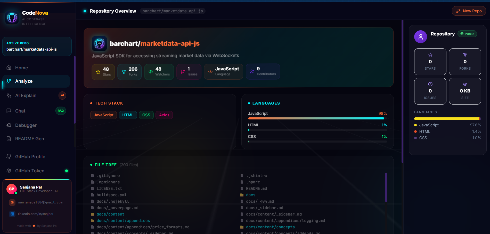

<div align="center">
  
  <h1>CodeNova AI</h1>
  <p><strong>A GitHub-focused AI Coding Assistant & Repository Intelligence Platform</strong></p>

  [](https://codenova-ai-ivory.vercel.app)
</div>

<br />

## 🚀 Overview

CodeNova AI is a futuristic, premium AI coding assistant that allows you to instantly understand, chat with, and debug any GitHub repository. 

### 🖼️ How It Works (The Dashboard Experience)
When you paste a GitHub URL into CodeNova AI, the system instantly analyzes the repository and presents a comprehensive 3D dashboard:

1. **Repository Overview:** Get immediate context with metrics like Stars, Forks, Watchers, and Issues cleanly organized in glowing UI cards.
2. **Tech Stack & Languages:** The AI automatically detects the project's tech stack (e.g., JavaScript, HTML, CSS, Axios) and visualizes the language breakdown in interactive progress bars.
3. **Interactive File Tree:** Browse the entire repository structure (up to 200 files) directly from the dashboard without ever leaving the app.
4. **AI Toolkit (Sidebar):** Use the left sidebar to access powerful RAG-driven AI features:
   - **Analyze:** View the repository's core metrics and file tree.
   - **AI Explain:** Let the AI explain what the codebase does in plain English.
   - **Chat (RAG):** Ask specific questions about the code, and the AI will search the codebase to answer you.
   - **Debugger:** Paste error logs, and the AI will find the bug in the code.
   - **README Gen:** Auto-generate perfect documentation based on the code structure.

<br />



<br />

## 🌍 Deployment Architecture
CodeNova AI uses a modern, disconnected full-stack architecture optimized for heavy AI workloads:

- **Frontend (Vercel):** The Next.js dashboard is hosted on Vercel for lightning-fast edge delivery. It securely manages user interaction and connects seamlessly to the AI processing API.
- **Backend (Render):** The Node.js Express backend is deployed on a persistent server at Render. This is fundamentally required over serverless options (like Vercel functions) because the AI vector memory must be held continuously during chat sessions.

<br />

### ✨ Features
- **🧠 Repo Analyzer:** Deep-dive into architecture, files, and patterns instantly.
- **✨ AI Explain:** Get a plain-English explanation of complex codebases.
- **💬 AI Chat (RAG):** Ask natural language questions and get context-aware answers from the actual code.
- **🐛 AI Debugger:** Paste an error message and get root-cause analysis with suggested fixes.
- **📄 README Generator:** Auto-generate comprehensive, professional markdown documentation with a stunning custom-rendered UI preview.
- **⚡ Improvements:** AI-powered suggestions for performance, security, and scalability.
- **⚖️ Compare Repos:** Side-by-side AI analysis of two repositories.

---

## 🛠️ Tech Stack

Built with a modern, high-performance web stack:

### Frontend
- **Next.js 14** (React Framework)
- **TypeScript** & **Tailwind CSS**
- **Framer Motion** (For smooth 3D animations and transitions)
- **Lucide React** (Icons)

### Backend
- **Node.js** & **Express.js**
- **MongoDB** (Session storage)
- **Google Gemini API** (`gemini-flash-lite-latest` for blazing-fast intelligence and `gemini-embedding-2` for embeddings)
- **GitHub REST API** (Octokit, heavily parallelized for sub-1-second load times)
- **In-Memory Vector Store** (For fast RAG retrieval)

---

## 📁 Project Structure

```text
📦 CodeNova AI
├── 📂 frontend/           # Next.js 14 Frontend Application
│   ├── 📂 src/
│   │   ├── 📂 app/        # Pages & Routing (Dashboard, Home)
│   │   ├── 📂 components/ # UI Components (3D Cards, ChatPanel, etc.)
│   │   └── 📂 lib/        # API clients
│   └── 📄 tailwind.config.ts
│
├── 📂 backend/            # Node.js/Express Server
│   ├── 📂 src/
│   │   ├── 📂 routes/     # API endpoints (ai.js, repo.js)
│   │   ├── 📂 services/   # Business logic (rag.js, github.js, ai.js)
│   │   └── 📄 index.js    # Entry point
│   └── 📄 .env            # Environment configurations
│
└── 📄 README.md
```

---

## 💻 Getting Started

### 1. Clone the repository
```bash
git clone https://github.com/sankri15/codenova-ai.git
cd codenova-ai
```

### 2. Setup Backend
```bash
cd backend
npm install
# Create a .env file and add your OPENAI_API_KEY and GITHUB_TOKEN
npm run dev
```

### 3. Setup Frontend
```bash
cd ../frontend
npm install
npm run dev
```
Open [http://localhost:3000](http://localhost:3000) in your browser.

---

## 👨‍💻 Author

**Sanjana Pal**
- 📧 Email: [sanjanpal004@gmail.com](mailto:sanjanpal004@gmail.com)
- 💼 LinkedIn: [www.linkedin.com/in/sanjpal](https://www.linkedin.com/in/sanjpal)
- 💻 GitHub: [@sankri15](https://github.com/sankri15)

<br/>
<div align="center">
  <sub>Built with ❤️ by Sanjana Pal</sub>
</div>


 
